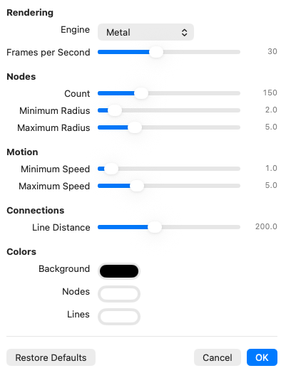

# Constellations

MacOS screen saver. Points of light drift across the screen, creating dynamic constellations.


## Installing

Download `Constellations.saver.zip` from the [latest release][latest] and unzip it.

The build is ad-hoc signed rather than notarized, so macOS quarantines it on download and will refuse to load it. Clear that flag
before installing:

```bash
xattr -dr com.apple.quarantine ~/Downloads/Constellations.saver
```

Then double-click the bundle and confirm the prompt. It shows up under System Settings →
Screen Saver → Other. To install by hand instead, copy it to `~/Library/Screen Savers/`.

If you would rather not run something unnotarized off the internet, build it
yourself instead; see [Building](#building).

[latest]: https://github.com/renoelmendorp/ConstellationsSaver/releases/latest

## Settings

Click **Options…** under the screen saver preview to open the settings pane. Changes apply live, so
you can watch the field react while you drag a slider; **Cancel** puts everything back the way it
was, and **Restore Defaults** returns every setting to the values below.



| Section | Setting | Default | Range |
| --- | --- | --- | --- |
| Rendering | Engine | Metal | Metal, Core Graphics |
| | Frames per Second | 30 | 10 – 60 |
| Nodes | Count | 150 | 10 – 500 |
| | Minimum Radius | 2.0 pt | 0.5 – 20 |
| | Maximum Radius | 5.0 pt | 0.5 – 20 |
| Motion | Minimum Speed | 1.0 pt/frame | 0 – 20 |
| | Maximum Speed | 5.0 pt/frame | 0 – 20 |
| Connections | Line Distance | 200 pt | 10 – 500 |
| Colors | Background | Black | any |
| | Nodes | White | any |
| | Lines | White | any |

Nodes are born just off the edge of the screen, drift across in a straight line, and are recycled
back to the edge once they leave. Each one picks a fresh radius and heading when it recycles, so
minimum and maximum radius set the range of sizes you see rather than resizing anything mid-flight.

Line Distance does double duty: it is both the range at which two nodes are joined and the margin
outside the screen where nodes live before they appear, so lines fade in from off screen rather than
popping into view at the edge.

## Rendering engines

**Metal** (default) draws the frame in two draw calls on GPU
**Core Graphics** is the original CPU renderer.

Both produce the same picture. Per-frame CPU time at 1920×1080 on
an Apple M1 Pro:

| Nodes | Core Graphics | Metal | |
| --- | --- | --- | --- |
| 150 (default) | 1.80 ms | 0.66 ms | 2.7× |
| 300 | 7.35 ms | 0.82 ms | 9.0× |
| 500 (maximum) | 20.93 ms | 1.26 ms | 16.7× |

The Core Graphics engine is kept because it needs no GPU at all. If Metal cannot be set up on a given Mac, the saver
falls back to Core Graphics on its own and the Metal option is disabled in the settings pane.

Frames per Second is the setting to reach for if you care about power: it scales both CPU and GPU
cost proportionally, and 20 fps is hard to tell apart from 30 for drifting points.

## Building

Requires Xcode and a Mac running macOS 13.1 or later for the screen saver itself. The project
compiles a `.metal` file, so Xcode needs the Metal Toolchain component:

```bash
xcodebuild -downloadComponent MetalToolchain
```

Without it the build fails with `cannot execute tool 'metal'`.

For a release build, `Scripts/release.sh` produces the same universal, ad-hoc signed
`Constellations.saver.zip` that the [Release workflow](.github/workflows/release.yml) attaches to
tagged releases:

```bash
./Scripts/release.sh
```

### Preview app

The **Constellations Preview** scheme runs the saver in an ordinary resizable window with a
**Settings…** button in the title bar. It is much faster to iterate against than reinstalling the
`.saver` and locking the screen. It targets a newer macOS than the saver bundle does.

MIT — see [LICENSE](LICENSE).
